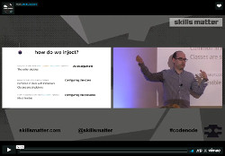

# LittleBoxes

[](http://badge.fury.io/rb/little_boxes)
[](https://travis-ci.org/manuelmorales/little-boxes)


LittleBoxes is a light library that helps to do dependency injection in Ruby.
It's main features are:

* Provides a dependency tree that represents your application configuration.
* Automatically configures your dependencies.
* Lazy-loads by default.

For an introduction to it you can watch the talk below, given at the
[London Ruby User Group](https://skillsmatter.com/skillscasts/9918-dependency-injection-with-little-boxes).
Slides are here [http://slides.com/manuelmorales-1/little-boxes-1](http://slides.com/manuelmorales-1/little-boxes-1).

[](https://skillsmatter.com/skillscasts/9918-dependency-injection-with-little-boxes)


Also, there is a [Todo-Backend](https://www.todobackend.com/) app built with LittleBoxes in
[https://github.com/manuelmorales/todo-backend-little-boxes](https://github.com/manuelmorales/todo-backend-little-boxes).
## Intro

LittleBoxes allows you to create a _box_ which is capable of providing already
configured objects that depend among each other.

```ruby
module MyApp
  class MainBox
    include LittleBoxes::Box

    let(:port) { 80 }
    letc(:server) { Server.new }
  end

  class Server
    include LittleBoxes::Configurable

    dependency :port
  end
end

box = MyApp::MainBox.new
# => #<MyApp::MainBox :port, :server>

box.server.port
# => 80
```

The `let` keyword provides lazy evaluated dependencies:

```ruby
class MainBox
  include LittleBoxes::Box

  let(:redis) do
    require 'redis'
    Redis.new
  end
end

box = MyApp::MainBox.new
box.redis
# => #<MyApp::Redis:0x0055acd05b6350>
```

Notice that in this situation `require 'redis'` will not evaluated until we
call `box.redis`. This approach, in opposition to initializers brings two
benefits:

* Libraries are only loaded when needed. Unused libraries are not loaded.
I. e. when running only a subset of the tests.
* There is no need to manually set the order of the initializers, it will be
resolved at run-time.

Dependencies can rely on other dependencies:

```ruby
class Publisher
  attr_accessor :redis

  def initialize(redis: redis)
    @redis = redis
  end
end

class MyApp::MainBox
  include LittleBoxes::Box

  let(:redis) do
    require 'redis'
    Redis.new
  end

  let(:publisher) do |box|
    Publisher.new redis: box.redis
  end
end

box = MyApp::MainBox.new
box.publisher
# => #<MyApp::Publisher:0x0055df32201ae0 @redis=#<MyApp::Redis:0x0055df32201b30>>
```

However, what kind of dependency injection library would this be if dependencies
wouldn't be automatically resolved. We can use the `letc` method for that:


```ruby
class Publisher
  include LittleBoxes::Configurable
  dependency :redis
end

class MainBox
  # ...

  letc(:publisher) { Publisher.new }
end
```

Configurable objects accept default values passed as a lambda, which receives
the box as an argument:

```ruby
class Server
  include LittleBoxes::Configurable
  dependency(:port) { 80 }
  dependency(:log) { |box| box.logger }
end
```


If classes instead of instances are your thing, not that I recommend it, the
`class_depency` will do:

```ruby
class UsersApi
  include LittleBoxes::Configurable
  class_dependency :logger
end

class MainBox
  # ...
  letc(:users_api) { UsersApi }
end
```

Working with classes you might find the problem that they tend to be accessed
directly through the constant, not injected. This totally skips the lazy
configuration we discussed before.

For those cases we can force the Box to eager-configure such dependency:

```ruby
class MainBox
  # ...
  eagerc(:users_api) { UsersApi }
end
```

Now the class will be configured as soon as you do `MainBox.new`.

Sometimes we don't want the box to memoize our dependencies and we want it
to execute the lambda each time. This were `get` and `getc` have a role:


```ruby
class MainBox
  # ...
  get(:config) { { port: 80 } }
  getc(:new_server) { Server.new }
end
```

Boxes can be nested, allowing to create a better arranged tree of dependencies.
Very useful as your application grows:

```ruby
class MainBox
  box(:users) do
    letc(:users_api) { UsersApi }
    let(:logger) { Logger.new('/tmp/users.log') }
  end

  let(:logger) { Logger.new('/tmp/app.log') }
end
```

Notice how in this case, any object inside the `users` box will log to
`users.log`. Dependencies are resolved recursively up to the root box.
Throwing a `LittleBoxes::DependencyNotFound` when missing at root level.

To avoid defining a huge single Box file, you can import boxes defined elsewhere:

```ruby
class UsersBox
  letc(:users_api) { UsersApi }
end

class MainBox
  import UsersBox

  let(:logger) { Logger.new('/tmp/app.log') }
end
```


## Contributing

Do not forget to run the tests with:

```bash
rake
```

And bump the version with any of:

```bash
$ gem bump --version 1.1.1       # Bump the gem version to the given version number
$ gem bump --version major       # Bump the gem version to the next major level (e.g. 0.0.1 to 1.0.0)
$ gem bump --version minor       # Bump the gem version to the next minor level (e.g. 0.0.1 to 0.1.0)
$ gem bump --version patch       # Bump the gem version to the next patch level (e.g. 0.0.1 to 0.0.2)
```

## License

Released under the MIT License.
See the [LICENSE](LICENSE.txt) file for further details.

